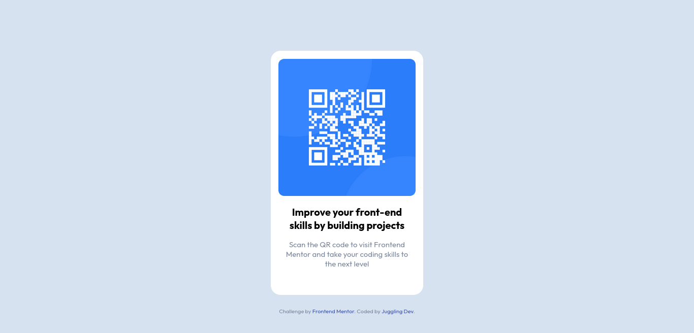

# Frontend Mentor - QR Code Component solution

This is a solution to the [QR code component challenge on Frontend Mentor](https://www.frontendmentor.io/challenges/qr-code-component-iux_sIO_H). Frontend Mentor challenges help you improve your coding skills by building realistic projects.

## Table of contents

- [Overview](#overview)
  - [Screenshot](#screenshot)
  - [Links](#links)
- [My process](#my-process)
  - [Built with](#built-with)
  - [What I learned](#what-i-learned)
  - [Continued development](#continued-development)
  - [Useful resources](#useful-resources)
- [Author](#author)
- [Acknowledgments](#acknowledgments)

## Overview

### Screenshot

### Links

- Solution URL: [QR Code Component solution](https://github.com/jugglingdev/qr-code-component)
- Live Site URL: [QR Code Component live site](https://jugglingdev.github.io/qr-code-component/)

## My process

### Built with

- Semantic HTML5
- CSS
- Google Fonts

### What I learned

This was my very first coding project built from scratch without the aid of a tutorial (hurray!).

After reviewing the style guide and design images, I first coded the HTML and then the CSS.  Had this project called for responsive design, I would have followed the best practice of styling for mobile first and then desktop.

Due to the simplicity of the design, I chose to not use Flexbox and instead mapped out a simple box model.  I also changed the `img` display to `block` instead of the default `inline` to make centering easier.

The style guide called for the `Outfit` font family from [Google Fonts](https://fonts.google.com/specimen/Outfit).  This was fairly easy to set up since it is externally hosted.  It was also rewarding to see the font change!

Wanting to work on my semantic HTML, I separated the attribution from the `card div` as a `footer`.

My favorite part of this exercise was working with link pseudo-classes.  I had fun selecting font colors that would complement the existing colors in the design for the `:hover`, `:active`, and `:visited` pseudo-classes.

Outside of what was given in the style guide, I did my best to match the margin, padding, and line-height of the design images.

Overall, it was a good first challenge with [Frontend Mentor](https://www.frontendmentor.io/home).  Nice and simple, but definitely a great first step to get me thinking from scratch.

### Continued development

I did not use Flexbox or advanced positioning for this project, so that is something I would like to practice in a future project to hone in on my HTML and CSS skills.

This project did not call for responsive design either, which is something else I would like to practice more in the future.  For instance, I would like to work with a project that utilizes `@media` queries for mobile, tablet, and desktop layouts.

### Useful resources

- [Interneting Is Hard: Link Psuedo-Classes](https://www.internetingishard.com/html-and-css/css-selectors/#pseudo-classes-for-links) - A favorite tutorial for CSS selectors including link pseudo-classes.

## Author

- GitHub - [@jugglingdev](https://github.com/jugglingdev)

- freeCodeCamp - [@jugglingdev](https://www.freecodecamp.org/jugglingdev)

- Frontend Mentor - [@jugglingdev](https://www.frontendmentor.io/profile/jugglingdev)

- LinkedIn - [Kayla Paden](https://www.linkedin.com/in/kayla-marie-paden)

## Acknowledgments

Shout out to Matt Studdert and the Frontend Mentor team for their commitment to helping developers gain practical skills and build their portfolios.